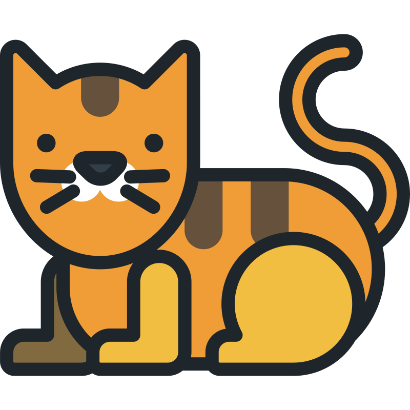

# Meownd

This project uses the [`CatAPI`](https://thecatapi.com) to dynamically generate cat images and facts by breed along with stories created by Gemini's multimodal AI.



## Technologies

- NodeJS (express, axios, cors)
- Gemini
- Cat API


## Run

- Install [nodejs](https://nodejs.org/en/download/prebuilt-installer/current)
- Acquire required packages found in **package.json** with  `npm install {pkg}`
- Get API keys from **[CatAPI](https://thecatapi.com/signup)** and **[GoogleAIStudio](https://aistudio.google.com/app/apikey)**
    - Reccomendation: use [`Gemini 1.5 Flash`](https://ai.google.dev/gemini-api/docs/models/gemini#gemini-1.5-flash) which is free and multimodal for 15 requests per minute
- Execute backend

    **Mac & Linux**
    ```bash
    CAT_API={key} GENAI_KEY={key} node src/backend.js
    ```
    **Windows**
    ```bash
    $env:CAT_API={key}
    $env:GENAI_KEY={key}
    node .\src\backend.js
    ```
- Open **CatMe.html** in a web browser on the same computer

## License

This project uses the MIT License
